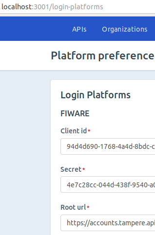
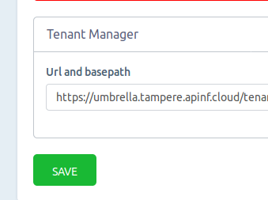
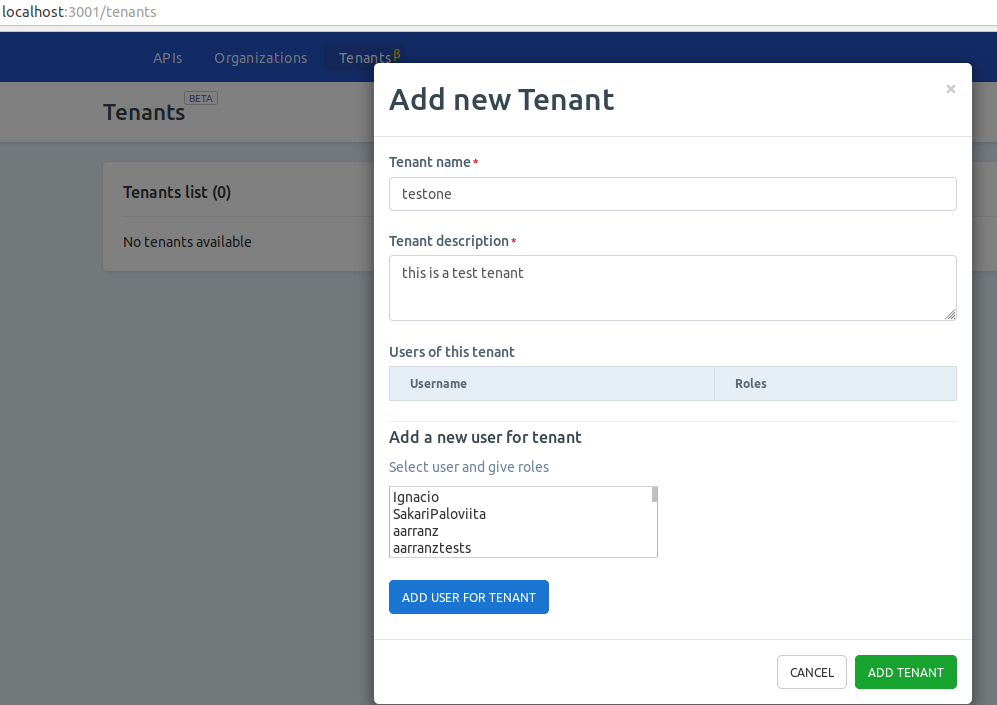
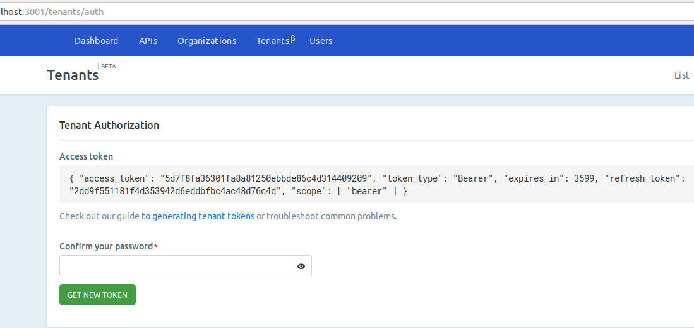
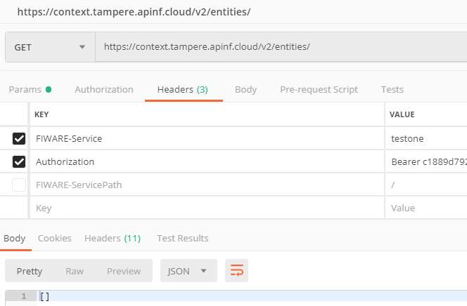
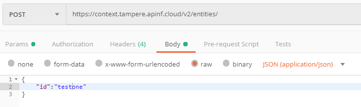
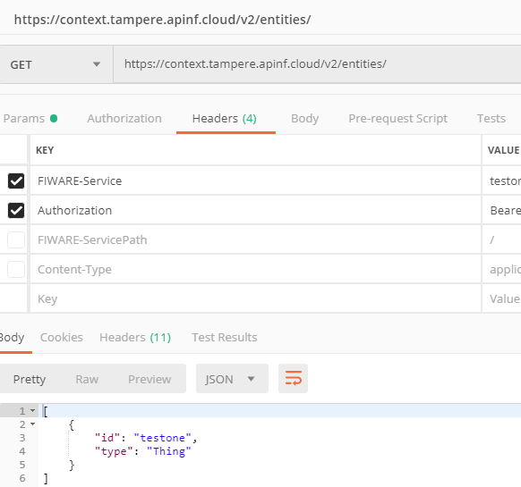

.. APInf API management documentation master file, created by
   sphinx-quickstart on Thu Jan 24 12:34:27 2019.

APInf - API management
========================================

We are proud to be part of `FIWARE <https://www.fiware.org>`_ thus the look and feel. 

You will find the source code of this project in `GitHub <https://github.com/apinf/platform>`_.
You will find the documentation of this project in Read the Docs and partially in Github. We are refactoring documentation. If you feel that there is information missing, please `raise an issue <https://github.com/apinf/platform/issues>`_ at Github as we tend to get blind. We do this all day.   

Quick Start
-----------

        Easy way to get familiar with APInf platform is to use our `SaaS <https://apinf.io>`_ 

We understand that poking around to see how things work is not for everyone. Please see this `document <https://github.com/apinf/platform/blob/develop/QuickStart.md>`_ to get introduction to the basics. There is a short `video <https://www.youtube.com/watch?v=yCR6pCnTm5w>`_ too!

Installation
============

**Note on migration**

We have updated MeteorJS version from 1.5.2 to 1.8. If you need to update the installation which is based on Meteor 1.5.2 to version which uses Meteor 1.8, you need to run MongoDB migration. More information here: https://docs.mongodb.com/manual/release-notes/3.6-upgrade-standalone/

The issue is that new version of MongoDB which comes with MeteorJS version 1.8 has new database engine; Procedure is to 1) mongo dump 2) upgrade to version with meteor 1.8 3)meteor reset 4) mongo restore 

**Note on different Umbrella versions**

We have forked the NREL/api-umbrella: https://github.com/apinf/apinf-umbrella; We have removed MongoDB from the umbrella image. You should deploy MongoDB in another container/machine and configure APInf Umbrella to use that external instance of MongoDB.
 
**From Source Code**

1. Clone APInf fork of umbrella: https://github.com/apinf/api-umbrella and follow the instructions in that repo. Easiest way to get started is to follow "With Docker Compose" section below and when you got that working, start exploring options. 
2. Install [Meteor.js](https://www.meteor.com/install) 
3. Clone [Apinf](https://github.com/apinf/platform), a new folder "platform" created. cd into that platform:

$ cd platform/
xxyy@ThinkPad-T430s:~/platform$ 

4. Run `meteor npm install` - using meteor instead npm makes sure the same npm is used that comes with meteor distribution:

`~/platform$ meteor npm install`

5. Type `meteor` in the project directory:

`ThinkPad-T430s:~/platform$ meteor`
                            
**Configure Umbrella:**

Register a new admin account. The first user will become Admin. You'll need this account later.

1. Signup to the APInf http://YOUR_SITE_DOMAIN/sign-up
2. Login to the APInf web admin http://YOUR_SITE_DOMAIN/sign-in
3. Fill APInf settings http://YOUR_SITE_DOMAIN/settings

**With Docker Compose**

Have a server with minimum of 2 GB ram and 20 GB disk. One core should be ok. Get a FQDN name for server - dont use Amazon AWS as we are using Let's Encrypt and they have blacklisted autogenerated AWS domain names. Or then you have to assign name on your own. 

Make sure that you have github application created for this domain. You need this in step 7. Here is a good read on how-to: https://auth0.com/docs/connections/social/github authorization callback url needs to be like https://YOUR_SITE_DOMAIN:3002 make sure to include the port.

1. Create "docker-compose.yml" file on your server and copy content from [docker-compose.yml](https://github.com/apinf/platform/blob/develop/docker-compose.yml).
2. In the same folder create file "docker/api-umbrella/config/api-umbrella.yml" based on example "docker/api-umbrella/config/api-umbrella.yml.example". ATTENTION: Replace "example.com" on YOUR_SITE_DOMAIN for keys "ssl_cert" and "ssl_cert_key".
3. Create file "docker/env.apinf" based on example "docker/env.apinf.example".
4. Create file "docker/env.ssl" based on example "docker/env.ssl.example".
5. Modify api-umbrella.yml to have github credentials (client_id and client_secret). Github only login is enabled at this time. If you have the skills, by modifying the api-umbrella.yml you can enable other login methods. Make sure also to modify the "initial_superusers" as you need to be able to login as super user.
6. Run `docker-compose up -d`. The first launch of it will be slow because (take couple of minutes) of the DH parameter computation and configure Let's Encrypt certificate.
7. Visit https://YOUR_SITE_DOMAIN:3002 to verify that proxy is running
8. Visit https://YOUR_SITE_DOMAIN:3002/admin/login and log in.
9. API key and Auth token you can get from umbrella, so login if you have not done so. The "Auth Token" need to come from admin, so on the right hand side pulldown menu (looks like a gear) pick "account or my account", there you can get the "Admin API token" (referred as Auth token later on). To get the API key, you need to go to https://YOUR_SITE_DOMAIN:3002/signup and fill the form. Copy the Auth token and API key. You need those in the next step.
10. Login to apinf platfrom https://YOUR_SITE_DOMAIN. When signing up as 1st user you get admin rights. To define proxy settings: Under your account pulldown menu, choose "proxy", click "add proxy" and fill in the following details:

* name: whatever you like
* description: whatever you like
* type: apiUmbrella

The following fields are revealed as you pick the "type":
* url: https://YOUR_SITE_DOMAIN:3002
* API KEY: - from umbrella, step 9
* AUTH TOKEN: - from umbrella, step 9
* ElasticSearch: "http://elasticsearch.docker:9200"

-> hit save. Now you are ready to add your 1st API.

11. Add API backend https://YOUR_SITE_DOMAIN/api/new 

You can use for example http://restcountries.eu/#api-endpoints-name as a test API. Note! It's better to pass the x-api-key as a header than in the URL! That's it. Now you can go to and check the Quick start, watch the video and enjoy!

A Few random notes: API Key and Auth token need to be from the same user. If you get into trouble, send us an email: info@apinf.io or raise an   issue.

**Github Configuration**

The Github configuration takes two values, a Client ID and Secret key. You can obtain these values by setting up a Github application from your Github user account.

Developer Documentation - how to call the API programmatically
--------------------------------------------------------------

APInf relies on Open API Spec documentation (previously Swagger) please see these links on how to access API management programmatically:

`Analytics <https://apinf.io/apis/apinf-analytics-api#api-documentation>`_

`Catalog <https://apinf.io/apis/apinf-catalog-rest-api-design#api-documentation>`_

`Management <https://apinf.io/apis/apinf-management-rest-api#api-documentation>`_

User Documentation - how to use the GUI
---------------------------------------

Basic flow after successful installation

1) sign-up (if you are the 1st user, you'll get admin rights!)
2) sign-in
3) add a proxy (if it does not already exist)
4) add an API and connect it to a proxy
5) test

Easy way to test the APInf platform is to try our `SaaS <https://apinf.io>`_ 

Check `this video <https://www.youtube.com/watch?v=yCR6pCnTm5w>`_

Tenant Manager UI
=================

GENERAL

Tenant manager is a new feature that is introduced with Apinf platfrom release 0.60.0. We are now bringing that feature out as Beta. This documentation is intended as introduction for system administrators, as you need to be able to configure additional components. Configuring additional components are not covered here.

Tenant is a Context Broker concept. Context Broker on it's own does not provide any access control. Tenant manager is an answer to that call. Basic principle is that you need to pass an Oauth token with the request, Apinf umbrella will take the token and validate that against Keyrock here is a picture that shows the overall architecture:

Tenant manager is a micro service. Our platform uses Meteor stack and you may have been used to the fact that things on UI happen in real time, thanks to the sockets. This means that when ever a request is done, it needs to go to tenant manger component and response is expected. So you may need to manually update the page to see changes. Not a big deal, just be aware of this.

**PRECONDITIONS**

1) you need to have keyrock instance running
2) you need to have tenant manager running
3) need to have Apinf umbrella running
4) OPTIONAL: to test the data transfer to Context Broker, have Context Broker running

**BASIC SETTINGS**

This section assumes that you know basic usage if Apinf platform.

1) Configure fiware / keyrock login:

2) Configure tenant manager url:

NOTE! it is important to secure the traffic to and from tenant manager. When retrieving token, user needs to provide a password in the request. If this goes plain on the wire, it's a security risk.

**ADDING A TENANT**

Navigate to Tenant UI, click Add, and fill in the details:

Hit Save. Request should complete and you should get a message saying things are ok:

.. image:: images/ten2.png

**RETRIEVING A TOKEN MANUALLY**

Go to authorisation and provide a password. If all goes fine, token is retrieved:

**RETRIEVING A TOKEN PROGRAMMATICALLY**

Two options exist: password & username method or refresh token. We recommend to use refresh token for production use. Example:

curl -v https://accounts.yyy.zzz.cloud/oauth2/password -d "grant_type=refresh_token&client_id=${TOKEN_SERVICE_CLIENT_ID}&client_secret=${TOKEN_SERVICE_CLIENT_SECRET}&refresh_token=${REFRESH_TOKEN}" -H "application/x-www-form-urlencoded"

TOKEN_SERVICE_CLIENT_ID` and `TOKEN_SERVICE_CLIENT_SECRET` are the OAuth2 credentials assigned to your APInf application and `REFRESH_TOKEN` is taken from the first response, for example the one you have from " RETRIEVING A TOKEN MANUALLY" 

You can make the initial token requests using the `"grant_type": "password"` option, and provide username and password.
   
**ACCESSING DATA USING TOKEN**

This example uses Postman, but you can do the request with also other tools. Let's construct the request. Enter two headers: Fiware-service and Authorization. Let's try 1st with GET:

What happens is that there is no data in the Tenant. Let's POST some:

and try to retrieve again:

Ok, that's it. If any questions, please mail us: info@apinf.io or raise and issues at github
APInf API management
--------------------

Why use Apinf API Management?
-----------------------------

If you have APIs and you are looking for additional control on API access, API documentation and analytics in one package, this is for you.

The APInf platform offers a comprehensive tool for API management. Building on APInf Umbrella, it provides enhanced user interface features for API managers and consumers alike.

For API consumers APInf provides simple key management, key usage analytics and API discovery along with API documentation. Managers have simplified workflow for common tasks, such as key management, rate limiting and viewing API usage analytics.

Basic Architecture
------------------
APInf API management is composed of two main components; APInf platform and proxy. The proxy in use is APInf umbrella and it is controlled via APInf platform UI, no need to touch the Umbrella directly, unless you really, really know what you are doing. 

Roadmap
-------
Roadmap is maintained in `"roadmap" <https://github.com/apinf/platform/blob/develop/roadmap.md>`_

.. toctree::
   :maxdepth: 2
   :caption: Contents:
